# ECS 教程

>原文
>
>https://github.com/Unity-Technologies/EntityComponentSystemSamples/EntitiesSamples/Assets/Tutorials/Tanks/README.md

## 概述

本教程将逐步创建一个非常简单的项目，介绍基本的 DOTS 概念。

## Unity 版本

教程使用的是 **2022.3.0f1c1**。

com.unity.entities.grpaphics **1.0.11**


## 创建项目

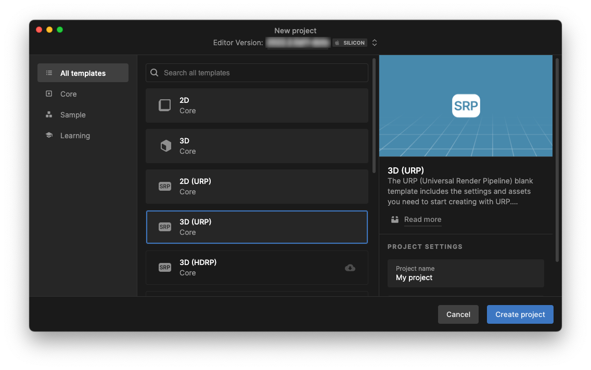


1. 使用 3D （URP） 模板在 Unity Hub 创建新项目。
2. 项目第一次打开时, 点击 "URP Empty Template" inspector 中的按钮 "Remove Readme Assets" 。用来删除不需要的目录 "Assets/TutorialInfo" 。
3. 我们需要添加一个 package  。其他依赖的 packages 将会自动一起添加 。`Window > Package Manager` , 点击左上角的 `+` 按钮，并选择 "Add package by name" 。在 "Name" 里填写 "com.unity.entities.graphics"，"Version" 保持空白。点击 "Add" 按钮。我们就只需要等待 package 安装完成。

    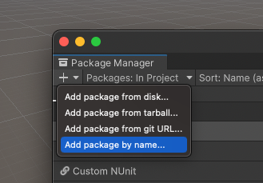
4. 在 `Edit > Project Settings > Editor`, 勾选 "Enter Play Mode Options" ，不要勾选 reload 子选项 `Reload Domain` 和 `Reload Scene` 。

    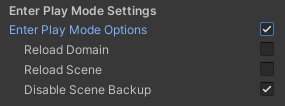

5. 在 Project window 中，在 Assets 目录下创建以下没有的目录:
    * Prefabs
    * Scenes (already created)
    * Scripts/Aspects
    * Scripts/Authoring
    * Scripts/MonoBehaviours
    * Scripts/Systems
    * Settings (already created)

    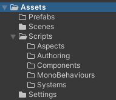

## 修改设置

> 设置 baking pipeline 属性。

设置 "Scene View Mode" 属性 (`Preferences/Entities`) 为 "Runtime Data" 。

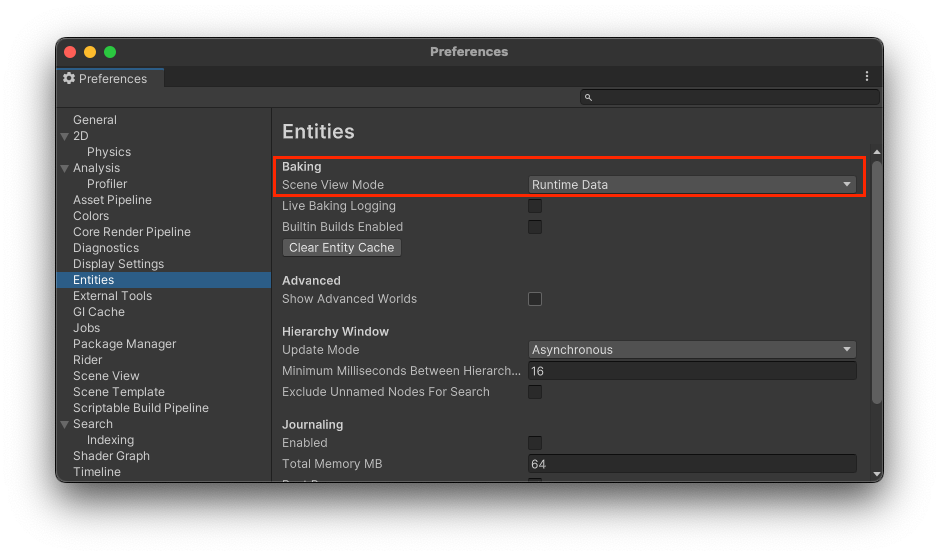

## 第一步 制作场景

1. 打开 Scenes 目录下的 SampleScene 。

2. Hierarchy 窗口中, 右键点击选择 `New Subscene > Empty Scene...` 。命名为 "EntityScene" ，把文件保存在 `Scenes/SampleScene` 目录。


3. 右键点击 Hierarchy window 中的 "EntityScene" ，选择创建一个新的 GameObject `GameObject > 3D Object > Cube` 命名为 "Tank" 。设置它的 Position 为 (0,0,0) ， Rotation 为 (0,0,0) ，Scale 为 (1,1,1) 。

4. 右键点击 Hierarchy window 中的 "Tank" ，选择创建一个新的 GameObject `3D Object > Sphere` 命名为 "Turret" 。设置它的 **Position** 为 (0,0.5,0) ，**Rotation** 为 (45,0,0) ，Scale 为 (1,1,1) 。

5. 右键点击 Hierarchy window 中的 "Turret"  ，选择创建一个新的 GameObject `3D Object > Cylinder` 命名为 "Cannon" 。设置它的 **Position 为 (0,0.5,0)** ，Rotation 为 (0,0,0) ，**Scale** 为 (0.2,0.5,0.2) 。

6. 右键点击 Hierarchy window 中的 "Cannon" ，选择创建一个新的 GameObject `Create Empty` 命名为 "SpawnPoint" 。设置它的 **Position** 为 (0,1,0) ，**Rotation** 为 (-90,0,0) ，Scale 为 (1,1,1) 。

7. 我们会得到和下图相似的结果。<p>
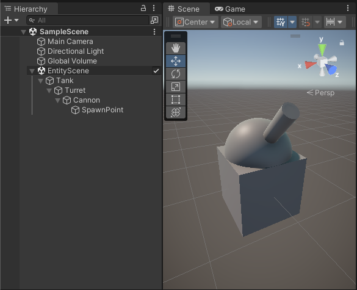

8. 需要删除节点对象中的碰撞体。<p>
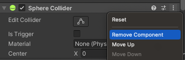

## 第二步 炮台 Turret 旋转

> Introducing the concepts of unmanaged systems (`ISystem`), queries, idiomatic `foreach`.

1. 在目录 "Scripts/Systems" 创建一个脚本文件 "TurretRotationSystem.cs"，文件内容如下：

    ```c#
    using Unity.Burst;
    using Unity.Entities;
    using Unity.Mathematics;
    using Unity.Transforms;

    // Unmanaged systems based on ISystem can be Burst compiled, but this is not yet the default,
    // so we have to explicitly opt into Burst compilation with the [BurstCompile] attribute.
    // It has to be added on BOTH the struct AND the OnCreate/OnDestroy/OnUpdate functions to be
    // effective.
    public partial struct TurretRotationSystem : ISystem
    {
        [BurstCompile]
        public void OnCreate(ref SystemState state)
        {
        }

        // This system doesn't need an OnDestroy method, so it uses the default empty one defined in ISystem.

        // See note above regarding the [BurstCompile] attribute.
        [BurstCompile]
        public void OnUpdate(ref SystemState state)
        {
            // Rotate 180 degrees around Y every second.
            var spin = quaternion.RotateY(SystemAPI.Time.DeltaTime * math.PI);

            // The SystemAPI.Query method can be called only as the 'in' clause of a foreach loop.
            // For these loops, source generation creates a query, and the loop iterates over each entity of the query.
            // In the example below, the query matches all entities with LocalTransform and Turret components.

            // We want to modify the LocalTransform component values, so we put RefRW<LocalTransform> in the Query call.
            foreach (var transform in
                    SystemAPI.Query<RefRW<LocalTransform>>())
            {
                // ValueRW returns a ref to the actual component value.
                // Add a rotation around the parent's Y axis.
                transform.ValueRW.Rotation = math.mul(spin, transform.ValueRO.Rotation);
            }
        }
    }
    ```

1. 进行 play 会看到如下图的效果。<p>
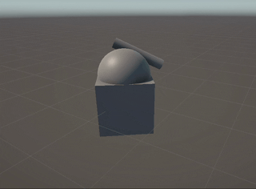

    | &#x1F4DD; NOTE |
    | :- |
    | 出现这种情况是因为 `foreach` 中我们旋转了所有的 transform 。我们希望只旋转炮台 Turret 。|

1. 在 "Scripts/Authoring" 文件夹中创建一个新的脚本文件 "TurretAuthoring.cs" ，文件内容如下：

    ```c#
    using Unity.Entities;
    using UnityEngine;

    class TurretAuthoring : MonoBehaviour
    {
        // Bakers convert authoring MonoBehaviours into entities and components.
        class Baker : Baker<TurretAuthoring>
        {
            public override void Bake(TurretAuthoring authoring)
            {
                // GetEntity returns the baked Entity form of a GameObject.
                var entity = GetEntity(TransformUsageFlags.Dynamic);
                AddComponent<Turret>(entity);
            }
        }
    }

    public struct Turret : IComponentData
    {
    }
    ```

1. 添加 "TurretAuthoring" component 到 "Turret" GameObject 。

1. 当选择 "Turret" GameObject 时， 展开 "Entity Conversion" panel ，我们能看见 "Turret" component 的标识。<p>
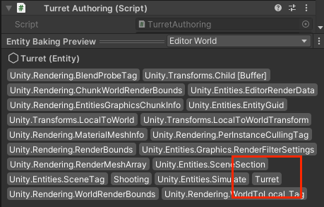

1. 按以下的内容修改 "Scripts/Systems" 文件中的文件 "TurretRotationSystem.cs" :

    ```diff
    using Unity.Burst;
    using Unity.Entities;
    using Unity.Mathematics;
    using Unity.Transforms;

    // Unmanaged systems based on ISystem can be Burst compiled, but this is not yet the default,
    // so we have to explicitly opt into Burst compilation with the [BurstCompile] attribute.
    // It has to be added on BOTH the struct AND the OnCreate/OnDestroy/OnUpdate functions to be
    // effective.
    public partial struct TurretRotationSystem : ISystem
    {
        [BurstCompile]
        public void OnCreate(ref SystemState state)
        {
        }

        // This system doesn't need an OnDestroy method, so it uses the default empty one defined in ISystem.

        // See note above regarding the [BurstCompile] attribute.
        [BurstCompile]
        public void OnUpdate(ref SystemState state)
        {
            // Rotate 180 degrees around Y every second.
            var spin = quaternion.RotateY(SystemAPI.Time.DeltaTime * math.PI);

            // The SystemAPI.Query method can be called only as the 'in' clause of a foreach loop.
            // For these loops, source generation creates a query, and the loop iterates over each entity of the query.
            // In the example below, the query matches all entities with LocalTransform and Turret components.

            // We want to modify the LocalTransform component values, so we put RefRW<LocalTransform> in the Query call.
    -       foreach (var transform in
    -           SystemAPI.Query<RefRW<LocalTransform>>())
    +       // Because we want to include Turret in the query but don't need to read or write
    +       // the Turret component values, we call WithAll<Turret>().
    +       // Without this WithAll() call, the query would match *all* entities having transform components,
    +       // and this foreach would rotate more than just the turrets.
    +       foreach (var transform in
    +           SystemAPI.Query<RefRW<LocalTransform>>()
    +           .WithAll<Turret>())
            {
                // ValueRW returns a ref to the actual component value.
                // Add a rotation around the parent's Y axis.
                transform.ValueRW.Rotation = math.mul(spin, transform.ValueRO.Rotation);
            }
        }
    }
    ```

1. 我们再进行 play 会看到如下图的效果。<p>
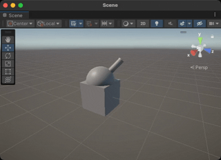


## 第三步 坦克移动
> 我们学习 `SystemBase` 和 `Entities.ForEach` 的并行使用。

1. 在目录 "Scripts/Authoring" 中创建新的脚本文件 "TankAuthoring.cs" ，填写如下内容：

    ```c#
    using Unity.Entities;
    using UnityEngine;

    class TankAuthoring : MonoBehaviour
    {
        class TankBaker : Baker<TankAuthoring>
        {
            public override void Bake(TankAuthoring authoring)
            {
                var entity = GetEntity(TransformUsageFlags.Dynamic);
                AddComponent<Tank>(entity);
            }
        }
    }

    // Just like we did with the turret, we create a tag component to identify the tank (cube).
    struct Tank : IComponentData
    {
    }
    ```

1. 添加 "TankAuthoring" component 到 "Tank" GameObject 。

1. 在目录 "Scripts/Systems" 中创建新的脚本文件 "TankMovementSystem.cs" ，填写如下内容：

    ```c#
    using Unity.Burst;
    using Unity.Entities;
    using Unity.Mathematics;
    using Unity.Transforms;

    public partial struct TankMovementSystem : ISystem
    {
        [BurstCompile]
        public void OnCreate(ref SystemState state)
        {
        }

        [BurstCompile]
        public void OnUpdate(ref SystemState state)
        {
            var dt = SystemAPI.Time.DeltaTime;

            foreach (var (transform, entity) in
                    SystemAPI.Query<RefRW<LocalTransform>>()
                        .WithAll<Tank>()
                        .WithEntityAccess())
            {
                var pos = transform.ValueRO.Position;

                // This does not modify the actual position of the tank, only the point at
                // which we sample the 3D noise function. This way, every tank is using a
                // different slice and will move along its own different random flow field.
                pos.y = (float)entity.Index;

                var angle = (0.5f + noise.cnoise(pos / 10f)) * 4.0f * math.PI;
                var dir = float3.zero;
                math.sincos(angle, out dir.x, out dir.z);

                transform.ValueRW.Position += dir * dt * 5.0f;
                transform.ValueRW.Rotation = quaternion.RotateY(angle);
            }
        }
    }

    ```

1. 这时进行 play 会看到如下图的效果。<p>
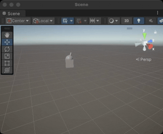

## 第四步 炮弹
> 学习创建一个 prefab ，并从 entities 引用别的 entities 。

1. 在目录 "Scripts/Authoring" 中创建新的脚本文件 "CannonBallAuthoring.cs" ，填写如下内容：

    ```c#
    using Unity.Entities;
    using Unity.Mathematics;
    using Unity.Rendering;

    class CannonBallAuthoring : UnityEngine.MonoBehaviour
    {
        class CannonBallBaker : Baker<CannonBallAuthoring>
        {
            public override void Bake(CannonBallAuthoring authoring)
            {
                var entity = GetEntity(TransformUsageFlags.Dynamic);

                // By default, components are zero-initialized,
                // so the Velocity field of CannonBall will be float3.zero.
                AddComponent<CannonBall>(entity);
            }
        }
    }

    public struct CannonBall : IComponentData
    {
        public float3 Velocity;
    }

    ```

1. 右键点击 Hierarchy 窗口中的 "SampleScene" ，创建一个 `GameObject > 3D Object > Sphere` 命名为 "CannonBall" 。设置它的 Position 为 (0,0,0) ，Rotation 为 (0,0,0) ，**Scale** 为 (0.2,0.2,0.2) 。

1. 添加 "CannonBallAuthoring" component 到 "CannonBall" GameObject 。

1. 删除 "CannonBall" GameObject 的 "Sphere Collider" component 。

1. 拖拽 "CannonBall" GameObject 节点到 Project 窗口中的 "Prefabs" 目录，形成一个 prefab 文件。

1. 删除 Hierarchy 窗口中 "SampleScene" 下的 "CannonBall" GameObject 。<p>
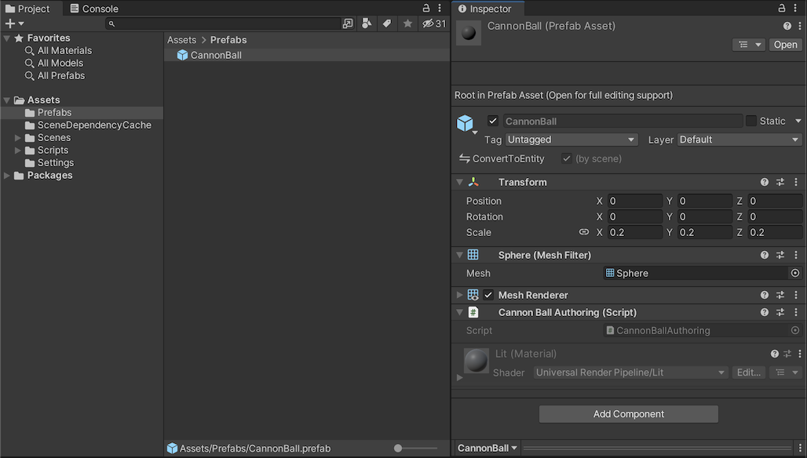

1. 修改 "Scripts/Authoring" 目录下的 "TurretAuthoring.cs" 文件：

    ```diff
    using Unity.Entities;
    using UnityEngine;

    class TurretAuthoring : MonoBehaviour
    {
        // Bakers convert authoring MonoBehaviours into entities and components.
    +    public GameObject CannonBallPrefab;
    +    public Transform CannonBallSpawn;

        class Baker : Baker<TurretAuthoring>
        {
            public override void Bake(TurretAuthoring authoring)
            {
                // GetEntity returns the baked Entity form of a GameObject.
                var entity = GetEntity(TransformUsageFlags.Dynamic);
    -            AddComponent<Turret>(entity);
    +            AddComponent(entity, new Turret
    +            {
    +                CannonBallPrefab = GetEntity(authoring.CannonBallPrefab, TransformUsageFlags.Dynamic),
    +                CannonBallSpawn = GetEntity(authoring.CannonBallSpawn, TransformUsageFlags.Dynamic)
    +            });
            }
        }
    }

    public struct Turret : IComponentData
    {
    +    // This entity will reference the nozzle of the cannon, where cannon balls should be spawned.
    +    public Entity CannonBallSpawn;

    +    // This entity will reference the prefab to be spawned every time the cannon shoots.
    +    public Entity CannonBallPrefab;
    }

    ```

1. 选择 "Turret" GameObject ，设置 "Turret Authoring" component 新的属性 "CannonBallPrefab" 和 "CannonBallSpawn" ， "CannonBallPrefab" 使用 "CannonBall" prefab ， "CannonBallSpawn" 选择 Hierarchy 窗口中的 "SpawnPoint" GameObject 。<p>
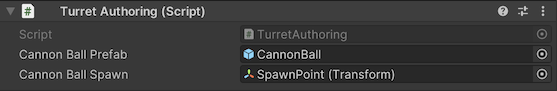

1. 在目录 "Scripts/Aspects" 中创建新的脚本文件 "TurretAspect.cs" ，填写如下内容：

    ```c#
    using Unity.Entities;
    using Unity.Mathematics;
    using Unity.Rendering;

    // Instead of directly accessing the Turret component, we are creating an aspect.
    // Aspects allows you to provide a customized API for accessing your components.
    readonly partial struct TurretAspect : IAspect
    {
        // This reference provides read only access to the Turret component.
        // Trying to use ValueRW (instead of ValueRO) on a read-only reference is an error.
        readonly RefRO<Turret> m_Turret;

        // Note the use of ValueRO in the following properties.
        public Entity CannonBallSpawn => m_Turret.ValueRO.CannonBallSpawn;
        public Entity CannonBallPrefab => m_Turret.ValueRO.CannonBallPrefab;
    }
    ```

1. 在目录 "Scripts/Systems" 中创建新的脚本文件 "TurretShootingSystem.cs" ，填写如下内容：

    ```c#
    using Unity.Burst;
    using Unity.Entities;
    using Unity.Mathematics;
    using Unity.Rendering;
    using Unity.Transforms;

    [UpdateInGroup(typeof(LateSimulationSystemGroup))]
    public partial struct TurretShootingSystem : ISystem
    {
        [BurstCompile]
        public void OnCreate(ref SystemState state)
        {
        }

        [BurstCompile]
        public void OnUpdate(ref SystemState state)
        {
            foreach (var (turret, localToWorld) in
                    SystemAPI.Query<TurretAspect, RefRO<LocalToWorld>>()
                        .WithAll<Shooting>())
            {
                Entity instance = state.EntityManager.Instantiate(turret.CannonBallPrefab);

                state.EntityManager.SetComponentData(instance, new LocalTransform
                {
                    Position = SystemAPI.GetComponent<LocalToWorld>(turret.CannonBallSpawn).Position,
                    Rotation = quaternion.identity,
                    Scale = SystemAPI.GetComponent<LocalTransform>(turret.CannonBallPrefab).Scale
                });

                state.EntityManager.SetComponentData(instance, new CannonBall
                {
                    Velocity = localToWorld.ValueRO.Up * 20.0f
                });
            }
        }
    }
    ```


1. play 。<p>
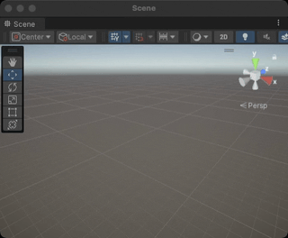

## 第五步 炮弹移动
> 学习并行 jobs.

1. 在目录 "Scripts/Systems" 中创建新的脚本文件 "CannonBallSystem.cs" ，填写如下内容：

    ```c#
    using Unity.Burst;
    using Unity.Entities;
    using Unity.Mathematics;
    using Unity.Transforms;

    // IJobEntity relies on source generation to implicitly define a query from the signature of the Execute function.
    [BurstCompile]
    public partial struct CannonBallJob : IJobEntity
    {
        public EntityCommandBuffer ECB;
        public float DeltaTime;

        void Execute(Entity entity, ref CannonBall cannonBall, ref LocalTransform transform)
        {
            var gravity = new float3(0.0f, -9.82f, 0.0f);
            var invertY = new float3(1.0f, -1.0f, 1.0f);

            transform.Position += cannonBall.Velocity * DeltaTime;

            // bounce on the ground
            if (transform.Position.y < 0.0f)
            {
                transform.Position *= invertY;
                cannonBall.Velocity *= invertY * 0.8f;
            }

            cannonBall.Velocity += gravity * DeltaTime;

            var speed = math.lengthsq(cannonBall.Velocity);
            if (speed < 0.1f)
            {
                ECB.DestroyEntity(entity);
            }
        }
    }

    [BurstCompile]
    partial struct CannonBallSystem : ISystem
    {
        [BurstCompile]
        public void OnCreate(ref SystemState state)
        {
            state.RequireForUpdate<CannonBall>();
        }

        [BurstCompile]
        public void OnUpdate(ref SystemState state)
        {
            var ecbSingleton = SystemAPI.GetSingleton<EndSimulationEntityCommandBufferSystem.Singleton>();

            var cannonBallJob = new CannonBallJob
            {
                ECB = ecbSingleton.CreateCommandBuffer(state.WorldUnmanaged),
                DeltaTime = SystemAPI.Time.DeltaTime
            };

            cannonBallJob.Schedule();
        }
    }

    ```

1. play 。<p>
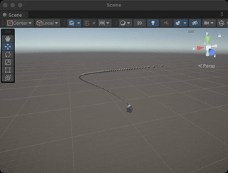

## 第六步 创建更多的坦克

1. 拖拽 "Tank" GameObject 到 Project 窗口中的 "Assets/Prefabs" 文件夹，生成一个 prefab 文件。

1. 删除 Hierarchy 窗口中的 "Tank" GameObject 。

1. 在目录 "Scripts/Authoring" 中创建新的脚本文件 "ConfigAuthoring.cs" ，填写如下内容：

    ```c#
    using Unity.Entities;
    using UnityEngine;

    public class ConfigAuthoring : MonoBehaviour
    {
        public GameObject TankPrefab;
        public int TankCount;
        public float SafeZoneRadius;

        class Baker : Baker<ConfigAuthoring>
        {
            public override void Bake(ConfigAuthoring authoring)
            {
                var entity = GetEntity(TransformUsageFlags.None);
                AddComponent(entity, new Config
                {
                    TankPrefab = GetEntity(authoring.TankPrefab, TransformUsageFlags.Dynamic),
                    TankCount = authoring.TankCount,
                    SafeZoneRadius = authoring.SafeZoneRadius
                });
            }
        }
    }

    public struct Config : IComponentData
    {
        public Entity TankPrefab;
        public int TankCount;
        public float SafeZoneRadius;
    }
    ```

1. 右键点击 Hierarchy 窗口中的 "EntityScene" ，创建一个 `Create Empty` GameObject 命名为 "Config" 。

1. 添加 "ConfigAuthoring" component 到 "Config" GameObject 。

1. 选择 "Config" GameObject ，设置 "Tank" prefab 到 "TankPrefab" ，"TankCount" 为 20 ，"SafeZoneRadius" 为 15 。<p>
    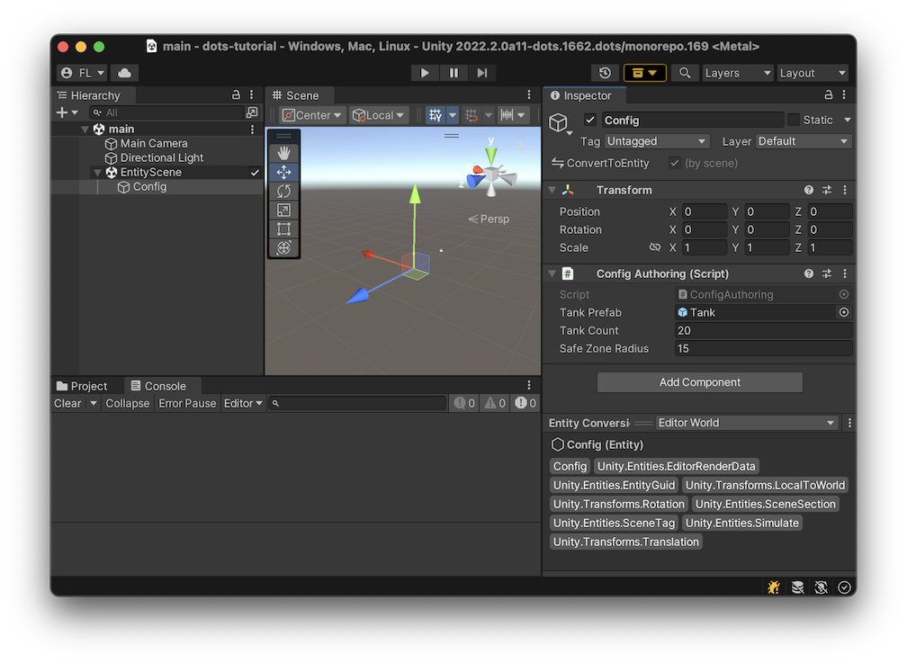

    | &#x1F4DD; 注意 |
    | :- |
    | "SafeZoneRadius" 是在后面的内容里使用。 |

1. 在目录 "Scripts/Systems" 中创建新的脚本文件 "TankSpawningSystem.cs" ，填写如下内容：

    ```c#
    using Unity.Burst;
    using Unity.Collections;
    using Unity.Entities;
    using Unity.Mathematics;
    using Unity.Rendering;
    using UnityEngine;

    partial struct TankSpawningSystem : ISystem
    {
        [BurstCompile]
        public void OnCreate(ref SystemState state)
        {
            state.RequireForUpdate<Config>();
        }

        [BurstCompile]
        public void OnUpdate(ref SystemState state)
        {
            state.Enabled = false;

            var config = SystemAPI.GetSingleton<Config>();
            var query = SystemAPI.QueryBuilder().WithAll<URPMaterialPropertyBaseColor>().Build();
            // An EntityQueryMask provides an efficient test of whether a specific entity would
            // be selected by an EntityQuery.
            var queryMask = query.GetEntityQueryMask();

            var ecb = new EntityCommandBuffer(Allocator.Temp);
            var tanks = new NativeArray<Entity>(config.TankCount, Allocator.Temp);
            ecb.Instantiate(config.TankPrefab, tanks);
            ecb.Playback(state.EntityManager);
        }
    }

    ```

1. play 。<p>
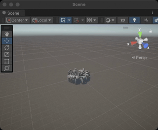

## 第七步 给坦克和炮弹上颜色

ECS components can control the inputs to the shaders used for rendering. Creating our own shaders (via shadergraph) and mapping custom ECS components to their inputs is out of scope for this tutorial, but we will use an already existing component called `URPMaterialPropertyBaseColor`. As the name implies, it allows controlling the base color of a standard URP material.

我们的坦克由三部分组成（坦克 tank ，炮塔 turrent ，炮管 cannon ），需要为每个部分添加 `URPMaterialPropertyBaseColor` component 。

1. 进入 play 模式。<p>
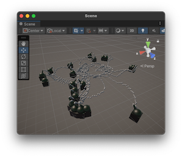

1.
    | &#x1F4DD; NOTE |
    | :- |
    | The EntityCommandBuffer used by the system below requires a query to specify which entities should be targeted by SetComponentForLinkedEntityGroup.<br>The core of an entity query consists a set of component types, and the query provides a filtered view of only the entities matching that set.<br>For more information about entity queries, see the [package documentation](https://docs.unity3d.com/Packages/com.unity.entities@latest/index.html?subfolder=/manual/ecs_entity_query.html). |

    修改 "Scripts/Systems" 目录下的 "TankSpawningSystem.cs" 文件：

    ```diff
    using Unity.Burst;
    using Unity.Collections;
    using Unity.Entities;
    using Unity.Mathematics;
    using Unity.Rendering;
    using UnityEngine;
    +   using Random = Unity.Mathematics.Random;

    partial struct TankSpawningSystem : ISystem
    {
        [BurstCompile]
        public void OnCreate(ref SystemState state)
        {
            state.RequireForUpdate<Config>();
        }

        [BurstCompile]
        public void OnUpdate(ref SystemState state)
        {
            state.Enabled = false;

            var config = SystemAPI.GetSingleton<Config>();
            // This system will only run once, so the random seed can be hard-coded.
            // Using an arbitrary constant seed makes the behavior deterministic.
    +        var random = new Random(123);

            var query = SystemAPI.QueryBuilder().WithAll<URPMaterialPropertyBaseColor>().Build();
            // An EntityQueryMask provides an efficient test of whether a specific entity would
            // be selected by an EntityQuery.
            var queryMask = query.GetEntityQueryMask();

            var ecb = new EntityCommandBuffer(Allocator.Temp);
            var tanks = new NativeArray<Entity>(config.TankCount, Allocator.Temp);
            ecb.Instantiate(config.TankPrefab, tanks);

    +        foreach (var tank in tanks)
    +        {
    +            // Every root entity instantiated from a prefab has a LinkedEntityGroup component, which
    +            // is a list of all the entities that make up the prefab hierarchy.
    +            ecb.SetComponentForLinkedEntityGroup(tank, queryMask,
    +                new URPMaterialPropertyBaseColor { Value = RandomColor(ref random) });
    +        }

            ecb.Playback(state.EntityManager);
        }

        // Helper to create any amount of colors as distinct from each other as possible.
        // See https://martin.ankerl.com/2009/12/09/how-to-create-random-colors-programmatically/
        static float4 RandomColor(ref Random random)
        {
            // 0.618034005f is inverse of the golden ratio
            var hue = (random.NextFloat() + 0.618034005f) % 1;
            return (Vector4)Color.HSVToRGB(hue, 1.0f, 1.0f);
        }
    }

    ```

1. play 。<p>
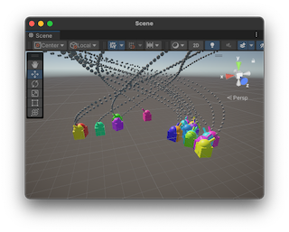

1. 修改 "Scripts/Authoring" 目录下的 "CannonBallAuthoring.cs" 文件：

    ```diff
    using Unity.Entities;
    using Unity.Mathematics;
    using Unity.Rendering;

    class CannonBallAuthoring : UnityEngine.MonoBehaviour
    {
        class CannonBallBaker : Baker<CannonBallAuthoring>
        {
            public override void Bake(CannonBallAuthoring authoring)
            {
                var entity = GetEntity(TransformUsageFlags.Dynamic);

                // By default, components are zero-initialized,
                // so the Velocity field of CannonBall will be float3.zero.
                AddComponent<CannonBall>(entity);

    +            AddComponent<URPMaterialPropertyBaseColor>(entity);
            }
        }
    }

    public struct CannonBall : IComponentData
    {
        public float3 Velocity;
    }

    ```

1. 修改 "Scripts/Aspects" 目录下的 "TurretAspect.cs" 文件：

    ```diff
    using Unity.Entities;
    using Unity.Mathematics;
    using Unity.Rendering;

    // Instead of directly accessing the Turret component, we are creating an aspect.
    // Aspects allows you to provide a customized API for accessing components.
    public readonly partial struct TurretAspect : IAspect
    {
        // This reference provides read only access to the Turret component.
        // Trying to access ValueRW (instead of ValueRO) from a RefRO is an error.
        readonly RefRO<Turret> m_Turret;

        // can represent entities which do not have this component.
    +    readonly RefRO<URPMaterialPropertyBaseColor> m_BaseColor;

        public Entity CannonBallSpawn => m_Turret.ValueRO.CannonBallSpawn;
        public Entity CannonBallPrefab => m_Turret.ValueRO.CannonBallPrefab;
    +    public float4 Color => m_BaseColor.ValueRO.Value;
    }

    ```

1. 修改 "Scripts/Systems" 目录下的 "TurretShootingSystem.cs" 文件：

    ```diff
    using Unity.Burst;
    using Unity.Entities;
    using Unity.Mathematics;
    using Unity.Rendering;
    using Unity.Transforms;

    [UpdateInGroup(typeof(LateSimulationSystemGroup))]
    public partial struct TurretShootingSystem : ISystem
    {
        [BurstCompile]
        public void OnCreate(ref SystemState state)
        {
        }

        [BurstCompile]
        public void OnUpdate(ref SystemState state)
        {
            foreach (var (turret, localToWorld) in
                    SystemAPI.Query<TurretAspect, RefRO<LocalToWorld>>()
                        .WithAll<Shooting>())
            {
                Entity instance = state.EntityManager.Instantiate(turret.CannonBallPrefab);

                state.EntityManager.SetComponentData(instance, new LocalTransform
                {
                    Position = SystemAPI.GetComponent<LocalToWorld>(turret.CannonBallSpawn).Position,
                    Rotation = quaternion.identity,
                    Scale = SystemAPI.GetComponent<LocalTransform>(turret.CannonBallPrefab).Scale
                });

                state.EntityManager.SetComponentData(instance, new CannonBall
                {
                    Velocity = localToWorld.ValueRO.Up * 20.0f
                });

    +            state.EntityManager.SetComponentData(instance, new URPMaterialPropertyBaseColor
    +            {
    +                Value = turret.Color
    +            });
            }
        }
    }

    ```

1. play 。<p>


## 第八步 安全区

1. 修改 "Scripts/Authoring" 目录下的 "TurretAuthoring.cs" 文件：

    ```diff
    using Unity.Entities;
    using UnityEngine;

    class TurretAuthoring : MonoBehaviour
    {
        // Bakers convert authoring MonoBehaviours into entities and components.
        public GameObject CannonBallPrefab;
        public Transform CannonBallSpawn;

        class Baker : Baker<TurretAuthoring>
        {
            public override void Bake(TurretAuthoring authoring)
            {
                // GetEntity returns the baked Entity form of a GameObject.
                var entity = GetEntity(TransformUsageFlags.Dynamic);
                AddComponent(entity, new Turret
                {
                    CannonBallPrefab = GetEntity(authoring.CannonBallPrefab, TransformUsageFlags.Dynamic),
                    CannonBallSpawn = GetEntity(authoring.CannonBallSpawn, TransformUsageFlags.Dynamic)
                });

    +            AddComponent<Shooting>(entity);
            }
        }
    }

    public struct Turret : IComponentData
    {
        // This entity will reference the nozzle of the cannon, where cannon balls should be spawned.
        public Entity CannonBallSpawn;

        // This entity will reference the prefab to be spawned every time the cannon shoots.
        public Entity CannonBallPrefab;
    }

    + // This is a tag component that is also an "enableable component".
    + // Such components can be toggled on and off without removing the component from the entity,
    + // which would be less efficient and wouldn't retain the component's value.
    + // An Enableable component is initially enabled.
    + public struct Shooting : IComponentData, IEnableableComponent
    + {
    + }

    ```

1. 在目录 "Scripts/Systems" 中创建新的脚本文件 "SafeZoneSystem.cs" ，填写如下内容：

    ```c#
    using Unity.Burst;
    using Unity.Entities;
    using Unity.Mathematics;
    using Unity.Transforms;
    using UnityEngine;

    [UpdateBefore(typeof(TurretShootingSystem))]
    [UpdateInGroup(typeof(LateSimulationSystemGroup))]
    public partial struct SafeZoneSystem : ISystem
    {
        [BurstCompile]
        public void OnCreate(ref SystemState state)
        {
            state.RequireForUpdate<Config>();
        }

        [BurstCompile]
        public void OnUpdate(ref SystemState state)
        {
            float radius = SystemAPI.GetSingleton<Config>().SafeZoneRadius;

            // Debug rendering (the white circle).
            const float debugRenderStepInDegrees = 20;
            for (float angle = 0; angle < 360; angle += debugRenderStepInDegrees)
            {
                var a = float3.zero;
                var b = float3.zero;
                math.sincos(math.radians(angle), out a.x, out a.z);
                math.sincos(math.radians(angle + debugRenderStepInDegrees), out b.x, out b.z);
                Debug.DrawLine(a * radius, b * radius);
            }

            var safeZoneJob = new SafeZoneJob
            {
                SquaredRadius = radius * radius
            };
            safeZoneJob.ScheduleParallel();
        }
    }

    [WithAll(typeof(Turret))]
    [WithOptions(EntityQueryOptions.IgnoreComponentEnabledState)]
    [BurstCompile]
    public partial struct SafeZoneJob : IJobEntity
    {
        public float SquaredRadius;

        // Because we want the global position of a child entity, we read LocalToWorld instead of LocalTransform.
        void Execute(in LocalToWorld transformMatrix, EnabledRefRW<Shooting> shootingState)
        {
            shootingState.ValueRW = math.lengthsq(transformMatrix.Position) > SquaredRadius;
        }
    }

    ```

1. play 。坦克只会在安全区外进行射击。如果没能看见安全区，请按下图操作。<p>
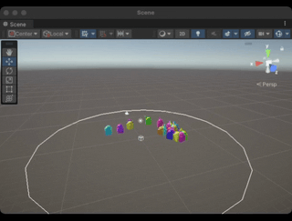
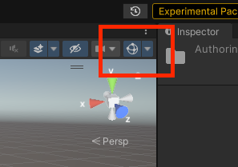

1. 在 play 模式中，改变 "Config" 的 "Safe Zone Radius" 属性。你会发现改变会实时生效。


## 第九步 相机跟随
> ECS 和 GameObjects 在 runtime 的时候的相互影响。

1. 在目录 "Scripts/MonoBehaviours" 中创建新的脚本文件 "CameraSingleton.cs" ，填写如下内容：

    ```c#
    // There are many ways of getting access to the main camera, but the approach here using
    // a singleton works for any kind of MonoBehaviour.
    using UnityEngine;

    public class CameraSingleton : MonoBehaviour
    {
        public static Camera Instance;

        void Awake()
        {
            Instance = GetComponent<Camera>();
        }
    }
    ```

1. 添加 "CameraSingleton" MonoBehaviour 到 "SampleScene" 的 "Main Camera" GameObject 。

1. 在目录 "Scripts/Systems" 中创建新的脚本文件 "CameraSystem.cs" ，填写如下内容：

    ```c#
    using Unity.Burst;
    using Unity.Collections;
    using Unity.Entities;
    using Unity.Transforms;
    using UnityEngine;
    using Random = Unity.Mathematics.Random;

    // This system should run after the transform system has been updated, otherwise the camera
    // will lag one frame behind the tank.
    [UpdateInGroup(typeof(LateSimulationSystemGroup))]
    public partial struct CameraSystem : ISystem
    {
        Entity target;
        Random random;

        [BurstCompile]
        public void OnCreate(ref SystemState state)
        {
            random = new Random(123);
        }

        // Because this OnUpdate accesses managed objects, it cannot be Burst-compiled.
        public void OnUpdate(ref SystemState state)
        {
            if (target == Entity.Null || Input.GetKeyDown(KeyCode.Space))
            {
                var tankQuery = SystemAPI.QueryBuilder().WithAll<Tank>().Build();
                var tanks = tankQuery.ToEntityArray(Allocator.Temp);
                if (tanks.Length == 0)
                {
                    return;
                }

                target = tanks[random.NextInt(tanks.Length)];
            }

            var cameraTransform = CameraSingleton.Instance.transform;
            var tankTransform = SystemAPI.GetComponent<LocalToWorld>(target);
            cameraTransform.position = tankTransform.Position;
            cameraTransform.position -= 10.0f * (Vector3)tankTransform.Forward;  // move the camera back from the tank
            cameraTransform.position += new Vector3(0, 5f, 0);  // raise the camera by an offset
            cameraTransform.LookAt(tankTransform.Position);
        }
    }

    ```

1. play 。会发现摄像机会跟随一个坦克。按下空格键会换一个坦克跟随。<p>
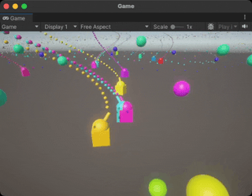

## 结束
