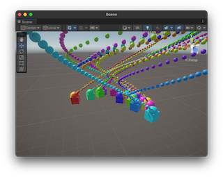

# ECS 教程

>原文
>
>https://github.com/Unity-Technologies/EntityComponentSystemSamples/blob/master/DOTS_Guide/ecs_tutorial/README.md

## 概述

本教程将逐步创建一个非常简单的项目，介绍基本的 DOTS 概念。

## Unity 版本

教程使用的是 **2022.2.0b16**。

## 创建项目


1. 使用 3D （URP） 模板在 Unity Hub 创建新项目。
2. 项目第一次打开时, 点击 "URP Empty Template" inspector 中的按钮 "Remove Readme Assets" 。用来删除不需要的目录 "Assets/TutorialInfo" 。
3. 我们需要添加一个 package  。其他依赖的 packages 将会自动一起添加 。`Window > Package Manager` , 点击左上角的 `+` 按钮，并选择 "Add package by name" 。在 "Name" 里填写 "com.unity.entities.graphics"，"Version" 保持空白。点击 "Add" 按钮。我们就只需要等待 package 安装完成。

    
4. 在 `Edit > Project Settings > Editor`, 勾选 "Enter Play Mode Options" ，不要勾选 reload 子选项 `Reload Domain` 和 `Reload Scene` 。

    

5. 在 Project window 中，在 Assets 目录下创建以下没有的目录:
    * Prefabs
    * Scenes (already created)
    * Scripts/Aspects
    * Scripts/Authoring
    * Scripts/Components
    * Scripts/MonoBehaviours
    * Scripts/Systems
    * Settings (already created)

    

## 修改设置

> 设置 baking pipeline 属性。

设置 "Scene View Mode" 属性 (`Preferences/Entities`) 为 "Runtime Data" 。


## 第一步 制作场景

1. 打开 Scenes 目录下的 SampleScene 。

2. Hierarchy 窗口中, 右键点击选择 `New Subscene > Empty Scene...` 。命名为 "EntityScene" ，把文件保存在 `Scenes/SampleScene` 目录。


3. 右键点击 Hierarchy window 中的 "EntityScene" ，选择创建一个新的 GameObject `GameObject > 3D Object > Cube` 命名为 "Tank" 。设置它的 Position 为 (0,0,0) ， Rotation 为 (0,0,0) ，Scale 为 (1,1,1) 。

4. 右键点击 Hierarchy window 中的 "Tank" ，选择创建一个新的 GameObject `3D Object > Sphere` 命名为 "Turret" 。设置它的 **Position** 为 (0,0.5,0) ，**Rotation** 为 (45,0,0) ，Scale 为 (1,1,1) 。

5. 右键点击 Hierarchy window 中的 "Turret"  ，选择创建一个新的 GameObject `3D Object > Cylinder` 命名为 "Cannon" 。设置它的 **Position 为 (0,0.5,0)** ，Rotation 为 (0,0,0) ，**Scale** 为 (0.2,0.5,0.2) 。

6. 右键点击 Hierarchy window 中的 "Cannon" ，选择创建一个新的 GameObject `Create Empty` 命名为 "SpawnPoint" 。设置它的 **Position** 为 (0,1,0) ，**Rotation** 为 (-90,0,0) ，Scale 为 (1,1,1) 。

7. 我们会得到和下图相似的结果。<p>


8. 需要删除节点对象中的碰撞体。<p>


## 第二步 炮台 Turret 旋转

> Introducing the concepts of unmanaged systems (`ISystem`), queries, idiomatic `foreach`.

1. 在目录 "Scripts/Systems" 创建一个脚本文件 "TurretRotationSystem.cs"，文件内容如下：

    ```c#
    using Unity.Burst;
    using Unity.Entities;
    using Unity.Mathematics;
    using Unity.Transforms;

    // Unmanaged systems based on ISystem can be Burst compiled, but this is not yet the default.
    // So we have to explicitly opt into Burst compilation with the [BurstCompile] attribute.
    // It has to be added on BOTH the struct AND the OnCreate/OnDestroy/OnUpdate functions to be
    // effective.
    [BurstCompile]
    partial struct TurretRotationSystem : ISystem
    {
        // Every function defined by ISystem has to be implemented even if empty.
        [BurstCompile]
        public void OnCreate(ref SystemState state)
        {
        }

        // Every function defined by ISystem has to be implemented even if empty.
        [BurstCompile]
        public void OnDestroy(ref SystemState state)
        {
        }

        // See note above regarding the [BurstCompile] attribute.
        [BurstCompile]
        public void OnUpdate(ref SystemState state)
        {
            // The amount of rotation around Y required to do 360 degrees in 2 seconds.
            var rotation = quaternion.RotateY(SystemAPI.Time.DeltaTime * math.PI);

            // The classic C# foreach is what we often refer to as "Idiomatic foreach" (IFE).
            // Aspects provide a higher level interface than directly accessing component data.
            // Using IFE with aspects is a powerful and expressive way of writing main thread code.
            foreach (var transform in SystemAPI.Query<TransformAspect>())
            {
                transform.RotateWorld(rotation);
            }
        }
    }
    ```

1. 进行 play 会看到如下图的效果。<p>


    | &#x1F4DD; NOTE |
    | :- |
    | 出现这种情况是因为 `foreach` 中我们旋转了所有的 transform 。我们希望只旋转炮台 Turret 。|

1. 在 "Scripts/Components" 文件夹中创建一个新的脚本文件 "Turret.cs" ，文件内容如下：

    ```c#
    using Unity.Entities;

    // An empty component is called a "tag component".
    struct Turret : IComponentData
    {
    }
    ```

1. 在 "Scripts/Authoring" 文件夹中创建一个新的脚本文件 "TurretAuthoring.cs" ，文件内容如下：

    ```c#
    using Unity.Entities;

    // Authoring MonoBehaviours are regular GameObject components.
    // They constitute the inputs for the baking systems which generates ECS data.
    class TurretAuthoring : UnityEngine.MonoBehaviour
    {
    }

    // Bakers convert authoring MonoBehaviours into entities and components.
    class TurretBaker : Baker<TurretAuthoring>
    {
        public override void Bake(TurretAuthoring authoring)
        {
            AddComponent<Turret>();
        }
    }
    ```

1. 添加 "TurretAuthoring" component 到 "Turret" GameObject 。

1. 当选择 "Turret" GameObject 时， 展开 "Entity Conversion" panel ，我们能看见 "Turret" component 的标识。<p>


1. 按以下的内容修改 "Scripts/Systems" 文件中的文件 "TurretRotationSystem.cs" :

    ```diff
     using Unity.Burst;
     using Unity.Entities;
     using Unity.Mathematics;
     using Unity.Transforms;
     
     [BurstCompile]
     partial struct TurretRotationSystem : ISystem
     {
         [BurstCompile]
         public void OnCreate(ref SystemState state)
         {
         }
     
         [BurstCompile]
         public void OnDestroy(ref SystemState state)
         {
         }
     
         [BurstCompile]
         public void OnUpdate(ref SystemState state)
         {
             var rotation = quaternion.RotateY(SystemAPI.Time.DeltaTime * math.PI);
     
    +        // WithAll adds a constraint to the query, specifying that every entity should have such component.
    +        foreach (var transform in SystemAPI.Query<TransformAspect>().WithAll<Turret>())
    -        foreach (var transform in SystemAPI.Query<TransformAspect>())
             {
                 transform.RotateWorld(rotation);
             }
         }
     }
    ```

1. 我们再进行 play 会看到如下图的效果。<p>


## 第三步 坦克移动
> 我们学习 `SystemBase` 和 `Entities.ForEach` 的并行使用。

1. 在目录 "Scripts/Components" 中创建新的脚本文件 "Tank.cs" ，填写如下内容：

    ```c#
    using Unity.Entities;

    // Just like we did with the turret, we create a tag component to identify the tank (cube).
    struct Tank : IComponentData
    {
    }
    ```

1. 在目录 "Scripts/Authoring" 中创建新的脚本文件 "TankAuthoring.cs" ，填写如下内容：

    ```c#
    using Unity.Entities;

    class TankAuthoring : UnityEngine.MonoBehaviour
    {
    }

    class TankBaker : Baker<TankAuthoring>
    {
        public override void Bake(TankAuthoring authoring)
        {
            AddComponent<Tank>();
        }
    }
    ```

1. 添加 "TankAuthoring" component 到 "Tank" GameObject 。

1. 在目录 "Scripts/Systems" 中创建新的脚本文件 "TankMovementSystem.cs" ，填写如下内容：

    ```c#
    using Unity.Entities;
    using Unity.Mathematics;
    using Unity.Transforms;

    // Contrarily to ISystem, SystemBase systems are classes.
    // They are not Burst compiled, and can use managed code.
    partial class TankMovementSystem : SystemBase
    {
        protected override void OnUpdate()
        {
            // The Entities.ForEach below is Burst compiled (implicitly).
            // And time is a member of SystemBase, which is a managed type (class).
            // This means that it wouldn't be possible to directly access Time from there.
            // So we need to copy the value we need (DeltaTime) into a local variable.
            var dt = SystemAPI.Time.DeltaTime;

            // Entities.ForEach is an older approach to processing queries. Its use is not
            // encouraged, but it remains convenient until we get feature parity with IFE.
            Entities
                .WithAll<Tank>()
                .ForEach((TransformAspect transform) =>
                {
                    // Notice that this is a lambda being passed as parameter to ForEach.
                    var pos = transform.Position;

                    // Unity.Mathematics.noise provides several types of noise functions.
                    // Here we use the Classic Perlin Noise (cnoise).
                    // The approach taken to generate a flow field from Perlin noise is detailed here:
                    // https://www.bit-101.com/blog/2021/07/mapping-perlin-noise-to-angles/
                    var angle = (0.5f + noise.cnoise(pos / 10f)) * 4.0f * math.PI;

                    var dir = float3.zero;
                    math.sincos(angle, out dir.x, out dir.z);
                    transform.Position += dir * dt * 5.0f;
                    transform.Rotation = quaternion.RotateY(angle);

                    // The last function call in the Entities.ForEach sequence controls how the code
                    // should be executed: Run (main thread), Schedule (single thread, async), or
                    // ScheduleParallel (multiple threads, async).
                    // Entities.ForEach is fundamentally a job generator, and it makes it very easy to
                    // create parallel jobs. This unfortunately comes with a complexity cost and weird
                    // arbitrary constraints, which is why more explicit approaches are preferred.
                    // Those explicit approaches (IJobEntity) are covered later in this tutorial.
                }).ScheduleParallel();
        }
    }
    ```

1. 这时进行 play 会看到如下图的效果。<p>


## 第四步 炮弹
> 学习创建一个 prefab ，并从 entities 引用别的 entities 。

1. 在目录 "Scripts/Components" 中创建新的脚本文件 "CannonBall.cs" ，填写如下内容：

    ```c#
    using Unity.Entities;
    using Unity.Mathematics;

    // Same approach for the cannon ball, we are creating a component to identify the entities.
    // But this time it's not a tag component (empty) because it contains data: the Speed field.
    // It won't be used immediately, but will become relevant when we implement motion.
    struct CannonBall : IComponentData
    {
        public float3 Speed;
    }
    ```

1. 在目录 "Scripts/Authoring" 中创建新的脚本文件 "CannonBallAuthoring.cs" ，填写如下内容：

    ```c#
    using Unity.Entities;
    using Unity.Rendering;

    class CannonBallAuthoring : UnityEngine.MonoBehaviour
    {
    }

    class CannonBallBaker : Baker<CannonBallAuthoring>
    {
        public override void Bake(CannonBallAuthoring authoring)
        {
            // By default, components are zero-initialized.
            // So in this case, the Speed field in CannonBall will be float3.zero.
            AddComponent<CannonBall>();
        }
    }
    ```

1. 右键点击 Hierarchy 窗口中的 "SampleScene" ，创建一个 `GameObject > 3D Object > Sphere` 命名为 "CannonBall" 。设置它的 Position 为 (0,0,0) ，Rotation 为 (0,0,0) ，**Scale** 为 (0.2,0.2,0.2) 。

1. 添加 "CannonBallAuthoring" component 到 "CannonBall" GameObject 。

1. 删除 "CannonBall" GameObject 的 "Sphere Collider" component 。

1. 拖拽 "CannonBall" GameObject 节点到 Project 窗口中的 "Prefabs" 目录，形成一个 prefab 文件。

1. 删除 Hierarchy 窗口中 "SampleScene" 下的 "CannonBall" GameObject 。<p>


1. 修改 "Scripts/Components" 目录下的 "Turret.cs" 文件：

    ```diff
     using Unity.Entities;
     
     struct Turret : IComponentData
     {
    +    // This entity will reference the nozzle of the cannon, where cannon balls should be spawned.
    +    public Entity CannonBallSpawn;
     
    +    // This entity will reference the prefab to be spawned every time the cannon shoots.
    +    public Entity CannonBallPrefab;
     }
    ```

1. 修改 "Scripts/Authoring" 目录下的 "TurretAuthoring.cs" 文件：

    ```diff
     using Unity.Entities;
     
     class TurretAuthoring : UnityEngine.MonoBehaviour
     {
    +    public UnityEngine.GameObject CannonBallPrefab;
    +    public UnityEngine.Transform CannonBallSpawn;
     }
     
     class TurretBaker : Baker<TurretAuthoring>
     {
         public override void Bake(TurretAuthoring authoring)
         {
    -        AddComponent<Turret>();
    +        AddComponent(new Turret
    +        {
    +            // By default, each authoring GameObject turns into an Entity.
    +            // Given a GameObject (or authoring component), GetEntity looks up the resulting Entity.
    +            CannonBallPrefab = GetEntity(authoring.CannonBallPrefab),
    +            CannonBallSpawn = GetEntity(authoring.CannonBallSpawn)
    +        });
         }
     }
    ```

1. 选择 "Turret" GameObject ，设置 "Turret Authoring" component 新的属性 "CannonBallPrefab" 和 "CannonBallSpawn" ， "CannonBallPrefab" 使用 "CannonBall" prefab ， "CannonBallSpawn" 选择 Hierarchy 窗口中的 "SpawnPoint" GameObject 。<p>


1. 在目录 "Scripts/Aspects" 中创建新的脚本文件 "TurretAspect.cs" ，填写如下内容：

    ```c#
    using Unity.Entities;
    using Unity.Mathematics;
    using Unity.Rendering;

    // Instead of directly accessing the Turret component, we are creating an aspect.
    // Aspects allows you to provide a customized API for accessing your components.
    readonly partial struct TurretAspect : IAspect
    {
        // This reference provides read only access to the Turret component.
        // Trying to use ValueRW (instead of ValueRO) on a read-only reference is an error.
        readonly RefRO<Turret> m_Turret;

        // Note the use of ValueRO in the following properties.
        public Entity CannonBallSpawn => m_Turret.ValueRO.CannonBallSpawn;
        public Entity CannonBallPrefab => m_Turret.ValueRO.CannonBallPrefab;
    }
    ```

1. 在目录 "Scripts/Systems" 中创建新的脚本文件 "TurretShootingSystem.cs" ，填写如下内容：

    ```c#
    using Unity.Burst;
    using Unity.Collections;
    using Unity.Entities;
    using Unity.Rendering;
    using Unity.Transforms;

    [BurstCompile]
    partial struct TurretShootingSystem : ISystem
    {
        // A ComponentLookup provides random access to a component (looking up an entity).
        // We'll use it to extract the world space position and orientation of the spawn point (cannon nozzle).
        ComponentLookup<LocalToWorldTransform> m_LocalToWorldTransformFromEntity;

        [BurstCompile]
        public void OnCreate(ref SystemState state)
        {
            // ComponentLookup structures have to be initialized once.
            // The parameter specifies if the lookups will be read only or if they should allow writes.
            m_LocalToWorldTransformFromEntity = state.GetComponentLookup<LocalToWorldTransform>(true);
        }

        [BurstCompile]
        public void OnDestroy(ref SystemState state)
        {
        }

        [BurstCompile]
        public void OnUpdate(ref SystemState state)
        {
            // ComponentLookup structures have to be updated every frame.
            m_LocalToWorldTransformFromEntity.Update(ref state);

            // Creating an EntityCommandBuffer to defer the structural changes required by instantiation.
            var ecbSingleton = SystemAPI.GetSingleton<BeginSimulationEntityCommandBufferSystem.Singleton>();
            var ecb = ecbSingleton.CreateCommandBuffer(state.WorldUnmanaged);

            // Creating an instance of the job.
            // Passing it the ComponentLookup required to get the world transform of the spawn point.
            // And the entity command buffer the job can write to.
            var turretShootJob = new TurretShoot
            {
                LocalToWorldTransformFromEntity = m_LocalToWorldTransformFromEntity,
                ECB = ecb
            };

            // Schedule execution in a single thread, and do not block main thread.
            turretShootJob.Schedule();
        }
    }

    [BurstCompile]
    partial struct TurretShoot : IJobEntity
    {
        [ReadOnly] public ComponentLookup<LocalToWorldTransform> LocalToWorldTransformFromEntity;
        public EntityCommandBuffer ECB;

        // Note that the TurretAspects parameter is "in", which declares it as read only.
        // Making it "ref" (read-write) would not make a difference in this case, but you
        // will encounter situations where potential race conditions trigger the safety system.
        // So in general, using "in" everywhere possible is a good principle.
        void Execute(in TurretAspect turret)
        {
            var instance = ECB.Instantiate(turret.CannonBallPrefab);
            var spawnLocalToWorld = LocalToWorldTransformFromEntity[turret.CannonBallSpawn];
            var cannonBallTransform = UniformScaleTransform.FromPosition(spawnLocalToWorld.Value.Position);

            // We are about to overwrite the transform of the new instance. If we didn't explicitly
            // copy the scale it would get reset to 1 and we'd have oversized cannon balls.
            cannonBallTransform.Scale = LocalToWorldTransformFromEntity[turret.CannonBallPrefab].Value.Scale;
            ECB.SetComponent(instance, new LocalToWorldTransform
            {
                Value = cannonBallTransform
            });
            ECB.SetComponent(instance, new CannonBall
            {
                Speed = spawnLocalToWorld.Value.Forward() * 20.0f
            });
        }
    }
    ```

1. play 。<p>


## 第五步 炮弹移动
> 学习并行 jobs.

1. 在目录 "Scripts/Aspects" 中创建新的脚本文件 "CannonBallAspect.cs" ，填写如下内容：

    ```c#
    using Unity.Entities;
    using Unity.Mathematics;
    using Unity.Transforms;

    readonly partial struct CannonBallAspect : IAspect
    {
        // An Entity field in an aspect provides access to the entity itself.
        // This is required for registering commands in an EntityCommandBuffer for example.
        public readonly Entity Self;

        // Aspects can contain other aspects.
        readonly TransformAspect Transform;

        // A RefRW field provides read write access to a component. If the aspect is taken as an "in"
        // parameter, the field will behave as if it was a RefRO and will throw exceptions on write attempts.
        readonly RefRW<CannonBall> CannonBall;

        // Properties like this are not mandatory, the Transform field could just have been made public instead.
        // But they improve readability by avoiding chains of "aspect.aspect.aspect.component.value.value".
        public float3 Position
        {
            get => Transform.Position;
            set => Transform.Position = value;
        }

        public float3 Speed
        {
            get => CannonBall.ValueRO.Speed;
            set => CannonBall.ValueRW.Speed = value;
        }
    }
    ```
1. 在目录 "Scripts/Systems" 中创建新的脚本文件 "CannonBallSystem.cs" ，填写如下内容：

    ```c#
    using Unity.Burst;
    using Unity.Entities;
    using Unity.Mathematics;

    [BurstCompile]
    // IJobEntity relies on source generation to implicitly define a query from the signature of the Execute function.
    partial struct CannonBallJob : IJobEntity
    {
        // A regular EntityCommandBuffer cannot be used in parallel, a ParallelWriter has to be explicitly used.
        public EntityCommandBuffer.ParallelWriter ECB;
        // Time cannot be directly accessed from a job, so DeltaTime has to be passed in as a parameter.
        public float DeltaTime;

        // The ChunkIndexInQuery attributes maps the chunk index to an int parameter.
        // Each chunk can only be processed by a single thread, so those indices are unique to each thread.
        // They are also fully deterministic, regardless of the amounts of parallel processing happening.
        // So those indices are used as a sorting key when recording commands in the EntityCommandBuffer,
        // this way we ensure that the playback of commands is always deterministic.
        void Execute([ChunkIndexInQuery] int chunkIndex, ref CannonBallAspect cannonBall)
        {
            var gravity = new float3(0.0f, -9.82f, 0.0f);
            var invertY = new float3(1.0f, -1.0f, 1.0f);

            cannonBall.Position += cannonBall.Speed * DeltaTime;
            if (cannonBall.Position.y < 0.0f)
            {
                cannonBall.Position *= invertY;
                cannonBall.Speed *= invertY * 0.8f;
            }

            cannonBall.Speed += gravity * DeltaTime;

            var speed = math.lengthsq(cannonBall.Speed);
            if (speed < 0.1f) ECB.DestroyEntity(chunkIndex, cannonBall.Self);
        }
    }

    [BurstCompile]
    partial struct CannonBallSystem : ISystem
    {
        [BurstCompile]
        public void OnCreate(ref SystemState state)
        {
        }

        [BurstCompile]
        public void OnDestroy(ref SystemState state)
        {
        }

        [BurstCompile]
        public void OnUpdate(ref SystemState state)
        {
            var ecbSingleton = SystemAPI.GetSingleton<EndSimulationEntityCommandBufferSystem.Singleton>();
            var ecb = ecbSingleton.CreateCommandBuffer(state.WorldUnmanaged);
            var cannonBallJob = new CannonBallJob
            {
                // Note the function call required to get a parallel writer for an EntityCommandBuffer.
                ECB = ecb.AsParallelWriter(),
                // Time cannot be directly accessed from a job, so DeltaTime has to be passed in as a parameter.
                DeltaTime = SystemAPI.Time.DeltaTime
            };
            cannonBallJob.ScheduleParallel();
        }
    }
    ```

1. play 。<p>


## 第六步 创建更多的坦克

1. 拖拽 "Tank" GameObject 到 Project 窗口中的 "Assets/Prefabs" 文件夹，生成一个 prefab 文件。

1. 删除 Hierarchy 窗口中的 "Tank" GameObject 。

1. 在目录 "Scripts/Components" 中创建新的脚本文件 "Config.cs" ，填写如下内容：

    ```c#
    using Unity.Entities;

    struct Config : IComponentData
    {
        public Entity TankPrefab;
        public int TankCount;
        public float SafeZoneRadius;
    }
    ```

1. 在目录 "Scripts/Authoring" 中创建新的脚本文件 "ConfigAuthoring.cs" ，填写如下内容：

    ```c#
    using Unity.Entities;

    class ConfigAuthoring : UnityEngine.MonoBehaviour
    {
        public UnityEngine.GameObject TankPrefab;
        public int TankCount;
        public float SafeZoneRadius;
    }

    class ConfigBaker : Baker<ConfigAuthoring>
    {
        public override void Bake(ConfigAuthoring authoring)
        {
            AddComponent(new Config
            {
                TankPrefab = GetEntity(authoring.TankPrefab),
                TankCount = authoring.TankCount,
                SafeZoneRadius = authoring.SafeZoneRadius
            });
        }
    }
    ```

1. 右键点击 Hierarchy 窗口中的 "EntityScene" ，创建一个 `Create Empty` GameObject 命名为 "Config" 。

1. 添加 "ConfigAuthoring" component 到 "Config" GameObject 。

1. 选择 "Config" GameObject ，设置 "Tank" prefab 到 "TankPrefab" ，"TankCount" 为 20 ，"SafeZoneRadius" 为 15 。<p>
    

    | &#x1F4DD; 注意 |
    | :- |
    | "SafeZoneRadius" 是在后面的内容里使用。 |

1. 在目录 "Scripts/Systems" 中创建新的脚本文件 "TankSpawningSystem.cs" ，填写如下内容：

    ```c#
    using Unity.Burst;
    using Unity.Collections;
    using Unity.Entities;
    using Unity.Mathematics;
    using Unity.Rendering;

    [BurstCompile]
    partial struct TankSpawningSystem : ISystem
    {
        [BurstCompile]
        public void OnCreate(ref SystemState state)
        {
        }

        [BurstCompile]
        public void OnDestroy(ref SystemState state)
        {
        }

        [BurstCompile]
        public void OnUpdate(ref SystemState state)
        {
            var config = SystemAPI.GetSingleton<Config>();

            var ecbSingleton = SystemAPI.GetSingleton<BeginSimulationEntityCommandBufferSystem.Singleton>();
            var ecb = ecbSingleton.CreateCommandBuffer(state.WorldUnmanaged);

            var vehicles = CollectionHelper.CreateNativeArray<Entity>(config.TankCount, Allocator.Temp);
            ecb.Instantiate(config.TankPrefab, vehicles);

            // This system should only run once at startup. So it disables itself after one update.
            state.Enabled = false;
        }
    }
    ```

    | &#x26A0; 注意 |
    | :- |
    | 这时进行 play 的话，只会看到一个坦克。事实上是有 20 个坦克，只是它们的运动轨迹重叠在一起了。|

1. 修改 "Scripts/Systems" 目录下的 "TankMovementSystem.cs" 文件：

    ```diff
     using Unity.Entities;
     using Unity.Mathematics;
     using Unity.Transforms;
     
     partial class TankMovementSystem : SystemBase
     {
         protected override void OnUpdate()
         {
             var dt = SystemAPI.Time.DeltaTime;
     
             Entities
                 .WithAll<Tank>()
    -            .ForEach((TransformAspect transform) =>
    +            .ForEach((Entity entity, TransformAspect transform) =>
                 {
                     var pos = transform.Position;
     
    +                // This does not modify the actual position of the tank, only the point at
    +                // which we sample the 3D noise function. This way, every tank is using a
    +                // different slice and will move along its own different random flow field.
    +                pos.y = entity.Index;
                     var angle = (0.5f + noise.cnoise(pos / 10f)) * 4.0f * math.PI;
     
                     var dir = float3.zero;
                     math.sincos(angle, out dir.x, out dir.z);
                     transform.Position += dir * dt * 5.0f;
                     transform.Rotation = quaternion.RotateY(angle);
     
                 }).ScheduleParallel();
         }
     }
    ```

1. play 。<p>


## 第七步 给坦克和炮弹上颜色

ECS components can control the inputs to the shaders used for rendering. Creating our own shaders (via shadergraph) and mapping custom ECS components to their inputs is out of scope for this tutorial, but we will use an already existing component called `URPMaterialPropertyBaseColor`. As the name implies, it allows controlling the base color of a standard URP material.

我们的坦克由三部分组成（坦克 tank ，炮塔 turrent ，炮管 cannon ），需要为每个部分添加 `URPMaterialPropertyBaseColor` component 。

1. 进入 play 模式。<p>


1.
    | &#x1F4DD; NOTE |
    | :- |
    | The EntityCommandBuffer used by the system below requires a query to specify which entities should be targeted by SetComponentForLinkedEntityGroup.<br>The core of an entity query consists a set of component types, and the query provides a filtered view of only the entities matching that set.<br>For more information about entity queries, see the [package documentation](https://docs.unity3d.com/Packages/com.unity.entities@latest/index.html?subfolder=/manual/ecs_entity_query.html). |

    修改 "Scripts/Systems" 目录下的 "TankSpawningSystem.cs" 文件：

    ```diff
     using Unity.Burst;
     using Unity.Collections;
     using Unity.Entities;
     using Unity.Mathematics;
     using Unity.Rendering;
     
     [BurstCompile]
     partial struct TankSpawningSystem : ISystem
     {
    +    // Queries should not be created on the spot in OnUpdate, so they are cached in fields.
    +    EntityQuery m_BaseColorQuery;
     
         [BurstCompile]
         public void OnCreate(ref SystemState state)
         {
    +        // This system should not run before the Config singleton has been loaded.
    +        state.RequireForUpdate<Config>();
     
    +        m_BaseColorQuery = state.GetEntityQuery(ComponentType.ReadOnly<URPMaterialPropertyBaseColor>());
         }
     
         [BurstCompile]
         public void OnDestroy(ref SystemState state)
         {
         }
     
         [BurstCompile]
         public void OnUpdate(ref SystemState state)
         {
             var config = SystemAPI.GetSingleton<Config>();
     
    +        // This system will only run once, so the random seed can be hard-coded.
    +        // Using an arbitrary constant seed makes the behavior deterministic.
    +        var random = Random.CreateFromIndex(1234);
    +        var hue = random.NextFloat();
     
    +        // Helper to create any amount of colors as distinct from each other as possible.
    +        // The logic behind this approach is detailed at the following address:
    +        // https://martin.ankerl.com/2009/12/09/how-to-create-random-colors-programmatically/
    +        URPMaterialPropertyBaseColor RandomColor()
    +        {
    +            // Note: if you are not familiar with this concept, this is a "local function".
    +            // You can search for that term on the internet for more information.
     
    +            // 0.618034005f == 2 / (math.sqrt(5) + 1) == inverse of the golden ratio
    +            hue = (hue + 0.618034005f) % 1;
    +            var color = UnityEngine.Color.HSVToRGB(hue, 1.0f, 1.0f);
    +            return new URPMaterialPropertyBaseColor { Value = (UnityEngine.Vector4)color };
    +        }
     
             var ecbSingleton = SystemAPI.GetSingleton<BeginSimulationEntityCommandBufferSystem.Singleton>();
             var ecb = ecbSingleton.CreateCommandBuffer(state.WorldUnmanaged);
     
             var vehicles = CollectionHelper.CreateNativeArray<Entity>(config.TankCount, Allocator.Temp);
             ecb.Instantiate(config.TankPrefab, vehicles);
     
    +        // An EntityQueryMask provides an efficient test of whether a specific entity would
    +        // be selected by an EntityQuery.
    +        var queryMask = m_BaseColorQuery.GetEntityQueryMask();
     
    +        foreach (var vehicle in vehicles)
    +        {
    +            // Every prefab root contains a LinkedEntityGroup, a list of all of its entities.
    +            ecb.SetComponentForLinkedEntityGroup(vehicle, queryMask, RandomColor());
    +        }
     
             state.Enabled = false;
         }
     }
    ```

1. play 。<p>


1. 修改 "Scripts/Authoring" 目录下的 "CannonBallAuthoring.cs" 文件：

    ```diff
     using Unity.Entities;
     using Unity.Rendering;
     
     class CannonBallAuthoring : UnityEngine.MonoBehaviour
     {
     }
     
     class CannonBallBaker : Baker<CannonBallAuthoring>
     {
         public override void Bake(CannonBallAuthoring authoring)
         {
             AddComponent<CannonBall>();
    +        AddComponent<URPMaterialPropertyBaseColor>();
         }
     }
    ```

1. 修改 "Scripts/Aspects" 目录下的 "TurretAspect.cs" 文件：

    ```diff
     using Unity.Entities;
     using Unity.Mathematics;
     using Unity.Rendering;
     
     readonly partial struct TurretAspect : IAspect
     {
         readonly RefRO<Turret> m_Turret;
    +    readonly RefRO<URPMaterialPropertyBaseColor> m_BaseColor;
     
         public Entity CannonBallSpawn => m_Turret.ValueRO.CannonBallSpawn;
         public Entity CannonBallPrefab => m_Turret.ValueRO.CannonBallPrefab;
    +    public float4 Color => m_BaseColor.ValueRO.Value;
     }
    ```

1. 修改 "Scripts/Systems" 目录下的 "TurretShootingSystem.cs" 文件：

    ```diff
     [BurstCompile]
     partial struct TurretShoot : IJobEntity
     {
         [ReadOnly] public ComponentLookup<LocalToWorldTransform> LocalToWorldTransformFromEntity;
         public EntityCommandBuffer ECB;
     
         void Execute(in TurretAspect turret)
         {
             var instance = ECB.Instantiate(turret.CannonBallPrefab);
             var spawnLocalToWorld = LocalToWorldTransformFromEntity[turret.CannonBallSpawn];
             var cannonBallTransform = UniformScaleTransform.FromPosition(spawnLocalToWorld.Value.Position);
     
             cannonBallTransform.Scale = LocalToWorldTransformFromEntity[turret.CannonBallPrefab].Value.Scale;
             ECB.SetComponent(instance, new LocalToWorldTransform
             {
                 Value = cannonBallTransform
             });
             ECB.SetComponent(instance, new CannonBall
             {
                 Speed = spawnLocalToWorld.Value.Forward() * 20.0f
             });
     
    +        // The line below propagates the color from the turret to the cannon ball.
    +        ECB.SetComponent(instance, new URPMaterialPropertyBaseColor { Value = turret.Color });
         }
     }
    ```

1. play 。<p>


## 第八步 安全区

1. 在目录 "Scripts/Components" 中创建新的脚本文件 "Shooting.cs" ，填写如下内容：

    ```c#
    using Unity.Entities;

    // This is a tag component that is also an "enableable component".
    // Such components can be toggled on and off while remaining present on the entity.
    // Doing so is a lot more efficient than adding and removing the component.
    struct Shooting : IComponentData, IEnableableComponent
    {
    }
    ```

1. 修改 "Scripts/Authoring" 目录下的 "TurretAuthoring.cs" 文件：

    ```diff
     using Unity.Entities;
     
     class TurretAuthoring : UnityEngine.MonoBehaviour
     {
         public UnityEngine.GameObject CannonBallPrefab;
         public UnityEngine.Transform CannonBallSpawn;
     }
     
     class TurretBaker : Baker<TurretAuthoring>
     {
         public override void Bake(TurretAuthoring authoring)
         {
             AddComponent(new Turret
             {
                 CannonBallPrefab = GetEntity(authoring.CannonBallPrefab),
                 CannonBallSpawn = GetEntity(authoring.CannonBallSpawn)
             });
     
    +        // Enableable components are always initially enabled.
    +        AddComponent<Shooting>();
         }
     }
    ```

1. 在目录 "Scripts/Systems" 中创建新的脚本文件 "SafeZoneSystem.cs" ，填写如下内容：

    ```c#
    using Unity.Burst;
    using Unity.Collections;
    using Unity.Entities;
    using Unity.Mathematics;
    using Unity.Transforms;

    // Requires the Turret type without processing it (it's not part of the Execute method).
    [WithAll(typeof(Turret))]
    [BurstCompile]
    partial struct SafeZoneJob : IJobEntity
    {
        // When running this job in parallel, the safety system will complain about a
        // potential race condition with TurretActiveFromEntity because accessing the same entity
        // from different threads would cause problems.
        // But the code of this job is written in such a way that only the entity being currently
        // processed will be looked up in TurretActiveFromEntity, making this process safe.
        // So we can disable the parallel safety check.
        [NativeDisableParallelForRestriction] public ComponentLookup<Shooting> TurretActiveFromEntity;

        public float SquaredRadius;

        void Execute(Entity entity, TransformAspect transform)
        {
            // The tag component Shooting will be enabled only if the tank is outside the given range.
            TurretActiveFromEntity.SetComponentEnabled(entity, math.lengthsq(transform.Position) > SquaredRadius);
        }
    }

    [BurstCompile]
    partial struct SafeZoneSystem : ISystem
    {
        // The ComponentLookup random accessors should not be created on the spot.
        // Just like EntityQuery, they should be created once and stored in a field.
        ComponentLookup<Shooting> m_TurretActiveFromEntity;

        [BurstCompile]
        public void OnCreate(ref SystemState state)
        {
            state.RequireForUpdate<Config>();

            m_TurretActiveFromEntity = state.GetComponentLookup<Shooting>();
        }

        [BurstCompile]
        public void OnDestroy(ref SystemState state)
        {
        }

        [BurstCompile]
        public void OnUpdate(ref SystemState state)
        {
            float radius = SystemAPI.GetSingleton<Config>().SafeZoneRadius;
            const float debugRenderStepInDegrees = 20;

            // Debug rendering (the white circle).
            for (float angle = 0; angle < 360; angle += debugRenderStepInDegrees)
            {
                var a = float3.zero;
                var b = float3.zero;
                math.sincos(math.radians(angle), out a.x, out a.z);
                math.sincos(math.radians(angle + debugRenderStepInDegrees), out b.x, out b.z);
                UnityEngine.Debug.DrawLine(a * radius, b * radius);
            }

            m_TurretActiveFromEntity.Update(ref state);
            var safeZoneJob = new SafeZoneJob
            {
                TurretActiveFromEntity = m_TurretActiveFromEntity,
                SquaredRadius = radius * radius
            };
            safeZoneJob.ScheduleParallel();
        }
    }
    ```

1. 修改 "Scripts/Systems" 目录下的 "TurretShootingSystem.cs" 文件：

    ```diff
    +// Requiring the Shooting tag component effectively prevents this job from running
    +// for the tanks which are in the safe zone.
    +[WithAll(typeof(Shooting))]
     [BurstCompile]
     partial struct TurretShoot : IJobEntity
     {
         [ReadOnly] public ComponentLookup<LocalToWorldTransform> LocalToWorldTransformFromEntity;
         public EntityCommandBuffer ECB;
     
         void Execute(in TurretAspect turret)
         {
             var instance = ECB.Instantiate(turret.CannonBallPrefab);
             var spawnLocalToWorld = LocalToWorldTransformFromEntity[turret.CannonBallSpawn];
             var cannonBallTransform = UniformScaleTransform.FromPosition(spawnLocalToWorld.Value.Position);
     
             cannonBallTransform.Scale = LocalToWorldTransformFromEntity[turret.CannonBallPrefab].Value.Scale;
             ECB.SetComponent(instance, new LocalToWorldTransform
             {
                 Value = cannonBallTransform
             });
             ECB.SetComponent(instance, new CannonBall
             {
                 Speed = spawnLocalToWorld.Value.Forward() * 20.0f
             });
     
             // The line below propagates the color from the turret to the cannon ball.
             ECB.SetComponent(instance, new URPMaterialPropertyBaseColor { Value = turret.Color });
         }
     }
    ```

1. play 。坦克只会在安全区外进行射击。如果没能看见安全区，请按下图操作。<p>


1. 在 play 模式中，改变 "Config" 的 "Safe Zone Radius" 属性。你会发现改变会实时生效。


## 第九步 相机跟随
> ECS 和 GameObjects 在 runtime 的时候的相互影响。

1. 在目录 "Scripts/MonoBehaviours" 中创建新的脚本文件 "CameraSingleton.cs" ，填写如下内容：

    ```c#
    // There are many ways of getting access to the main camera, but the approach using
    // a singleton (as we use here) works for any kind of MonoBehaviour.
    class CameraSingleton : UnityEngine.MonoBehaviour
    {
        public static UnityEngine.Camera Instance;

        void Awake()
        {
            Instance = GetComponent<UnityEngine.Camera>();
        }
    }
    ```

1. 添加 "CameraSingleton" MonoBehaviour 到 "SampleScene" 的 "Main Camera" GameObject 。

1. 在目录 "Scripts/Systems" 中创建新的脚本文件 "CameraSystem.cs" ，填写如下内容：

    ```c#
    using Unity.Collections;
    using Unity.Entities;
    using Unity.Mathematics;
    using Unity.Transforms;

    // This system should run after the transform system has been updated, otherwise the camera
    // will lag one frame behind the tank and will jitter.
    [UpdateInGroup(typeof(LateSimulationSystemGroup))]
    partial class CameraSystem : SystemBase
    {
        Entity Target;
        Random Random;
        EntityQuery TanksQuery;

        protected override void OnCreate()
        {
            Random = Random.CreateFromIndex(1234);
            TanksQuery = GetEntityQuery(typeof(Tank));
            RequireForUpdate(TanksQuery);
        }

        protected override void OnUpdate()
        {
            if (Target == Entity.Null || UnityEngine.Input.GetKeyDown(UnityEngine.KeyCode.Space))
            {
                var tanks = TanksQuery.ToEntityArray(Allocator.Temp);
                Target = tanks[Random.NextInt(tanks.Length)];
            }

            var cameraTransform = CameraSingleton.Instance.transform;
            var tankTransform = GetComponent<LocalToWorld>(Target);
            cameraTransform.position = tankTransform.Position - 10.0f * tankTransform.Forward + new float3(0.0f, 5.0f, 0.0f);
            cameraTransform.LookAt(tankTransform.Position, new float3(0.0f, 1.0f, 0.0f));
        }
    }
    ```

1. play 。会发现摄像机会跟随一个坦克。按下空格键会换一个坦克跟随。<p>


## 结束

计划后续添加基于 ECS 的优化。
